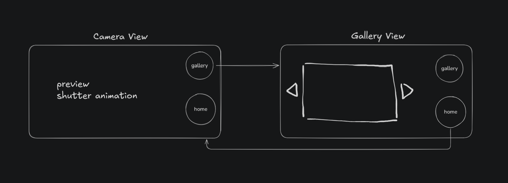
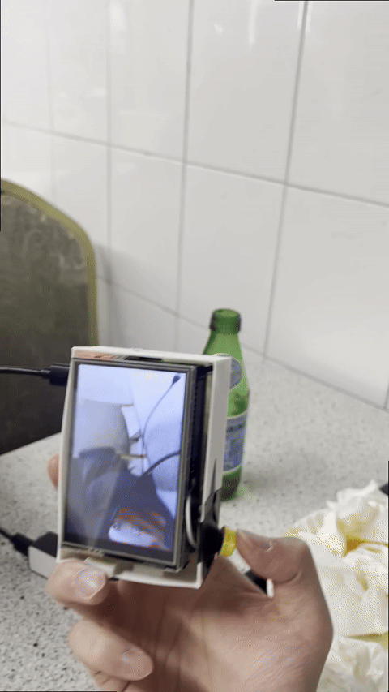
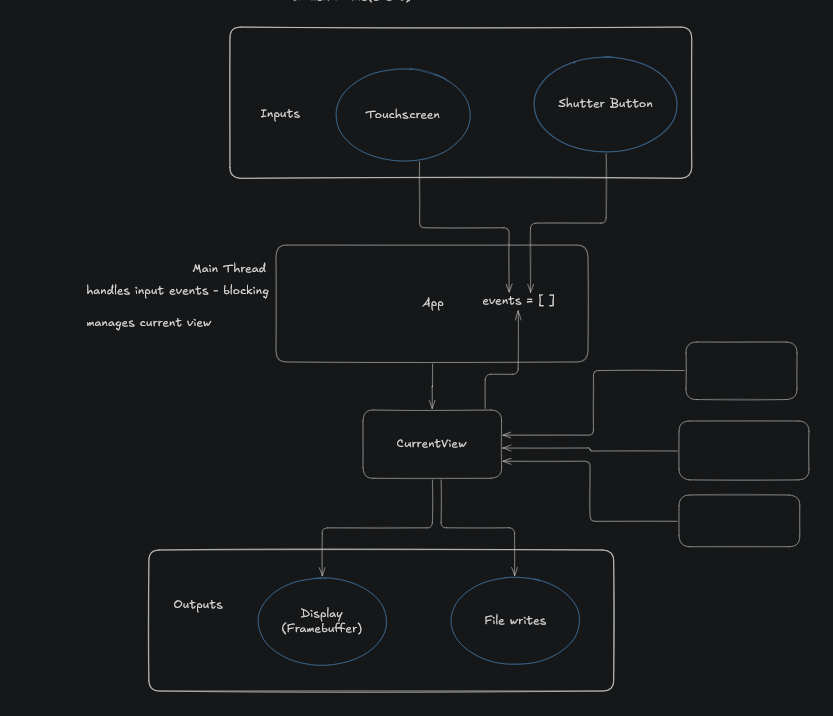
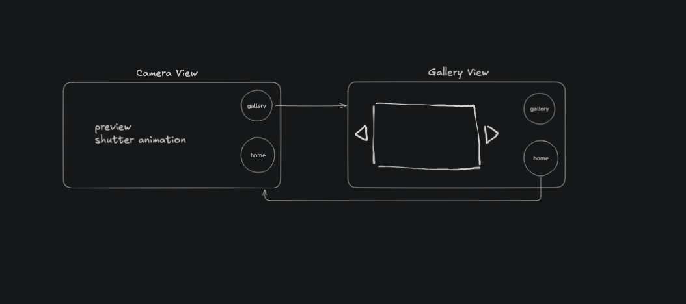

# DIY Raspberry Pi Camera Application

A custom camera application for Raspberry Pi with a 3.5" TFT touchscreen display. This project demonstrates real-time image capture, gallery browsing, settings control, and touch input handling on embedded Linux.



## Table of Contents

1. [Quick Overview](#quick-overview)
2. [Hardware](#hardware)
3. [Software Architecture](#software-architecture)
4. [Installation](#installation)
5. [How It Works](#how-it-works)
6. [Artifacts & System Structure](#artifacts--system-structure)
7. [What I Learned](#what-i-learned)

---

## Quick Overview

This is a fully functional camera application running as a systemd daemon on Raspberry Pi OS. Users can:

- **Capture photos** using a physical shutter button or on-screen button
- **View gallery** of previously captured images
- **Adjust settings** like JPEG quality and resolution
- **Touch interface** for seamless navigation between views




Images are stored in:

```
/data/photos
```

Filenames use timestamp format:

```
YYYY-MM-DD_HH-MM-SS.jpg
```

Example:

```
2026-02-14_12-03-08.jpg
```

## Hardware

Current hardware configuration:

**Compute**

* Raspberry Pi 3B+

**Camera**

* OV5647 (Arducam / Raspberry Pi Camera v1 compatible)

**Display**

* 3.5" SPI TFT
* Controller: ILI9486
* Resolution: 480×320
* Device: `/dev/fb1`

**Input**

* Physical shutter button (GPIO)

**Storage**

* MicroSD card

**Power**

* Currently direct power
* Future: battery + power controller

## Software Architecture



### System Components

```
Application (app.py)
├── Event Loop
│   ├── Touch Events (from /dev/input)
│   └── Shutter Events (from GPIO)
├── View Controller
│   ├── CameraView - Live preview & capture UI
│   ├── GalleryView - Browse saved photos
│   └── SettingsView - Configure quality & resolution
├── Device Drivers
│   ├── Framebuffer - Direct pixel access to TFT
│   └── Camera - rpicam-still binary wrapper
└── UI Components
    ├── Buttons - Touch-sensitive UI elements
    ├── Overlays - Status displays
    └── Font Rendering - Text on display
```



### Key Design Patterns

**Event-Driven Architecture**: The application loops continuously, polling the event queue for input from touchscreen or shutter button, then dispatching to the appropriate view handler.

**View Controller Pattern**: Similar to MVC, the controller manages transitions between CameraView, GalleryView, and SettingsView. Each view is responsible for its own rendering and input handling.

**Memory-Mapped Framebuffer**: Direct access to `/dev/fb1` using NumPy arrays for fast pixel operations. RGB565 16-bit color format matches the display's native format.

---

## Installation

The installation process is automated across three phases:

### Phase 1: Base System Setup (`00-base.sh`)

```bash
sudo bash setup/00-base.sh
```

- Updates package manager and installs dependencies
- Disables unused services to free resources
- Installs Python libraries: `python3-pil`, `python3-rpi.gpio`, `picamera2`

### Phase 2: Hardware Enablement (`01-boot.sh`)

```bash
sudo bash setup/01-boot.sh
```

- Loads the Device Tree Overlay (`tft35a-overlay.dtb`)
- Creates `/dev/fb1` for framebuffer access
- Creates `/dev/input/eventX` for touchscreen input
- Modifies `/boot/firmware/config.txt` to auto-load overlay on boot

**Why Device Tree Overlays?**  
Device Tree Overlays tell the Linux kernel which hardware drivers to load and how to wire GPIO pins. Instead of hardcoding hardware in the kernel, overlays make configurations flexible and replaceable.

### Phase 3: Service Installation (`02-services.sh`)

```bash
sudo bash setup/02-services.sh
```

- Copies application files to `/opt/camera/`
- Copies configuration to `/etc/camera/camera.conf`
- Registers systemd service at `/etc/systemd/system/camera.service`
- Enables auto-start on boot

**Starting the service:**
```bash
sudo systemctl start camera.service
sudo systemctl status camera.service
sudo journalctl -f -u camera.service  # View logs
```

---

## How It Works

### Boot Sequence

1. **Bootloader** loads Device Tree Overlay → patches `/dev/spi0`
2. **Kernel** matches device tree entries to drivers:
   - ILI9486 @ CS0 → framebuffer driver → `/dev/fb1`
   - ADS7846 @ CS1 → input driver → `/dev/input/eventX`
3. **Systemd** starts `camera.service`, which launches `app.py`
4. **Application** initializes framebuffer, camera, and input handlers
5. **Event loop** begins accepting input and rendering

### Main Application Flow

```python
# Initialization
fb = Framebuffer(fb_path="/dev/fb1", width=480, height=320)
camera = Camera(PHOTO_DIR="/data/photos")
controller = ViewController(current_view=CameraView, devices={fb, camera})

# Event Loop
while True:
    # Poll for events
    if event := event_queue.get(timeout=0.016):  # ~60 FPS
        # Route to current view
        controller.handle_input(event)
        
        # Current view renders itself
        current_view.render(fb)
```

### Rendering Pipeline

```
View.render()
├── Clear framebuffer to background color
├── Draw Images
│   ├── PIL Image → RGB → Resize
│   └── Convert to RGB565 → Memory-map to /dev/fb1
├── Draw UI Elements
│   ├── Buttons (PNG icons scaled)
│   └── Text overlays
└── Flush display (automatic via mmap)
```

### Input Handling

**Touchscreen**: `/dev/input/eventX` generates raw touch events → parsed to (x, y) coordinates → routed to button collision detection

**Shutter Button**: GPIO interrupt on GPIO pin → debounced → enqueued as BUTTON_PRESS event

---

## Artifacts & System Structure

After installation, the following artifacts are created:

### Application Files
- **`/opt/camera/app.py`** - Main event loop and initialization
- **`/opt/camera/framebuffer.py`** - Direct framebuffer access using mmap and NumPy
- **`/opt/camera/camera.py`** - Wrapper around `rpicam-still` binary
- **`/opt/camera/views/`** - View controllers (CameraView, GalleryView, SettingsView)
- **`/opt/camera/input/`** - Input processing (touch events, GPIO events)
- **`/opt/camera/assets/`** - PNG icons and UI resources

### Configuration
- **`/etc/camera/camera.conf`** - Configuration parameters (framebuffer path, photo directory, GPIO pins)
- **`/etc/systemd/system/camera.service`** - Service definition (auto-restart, standard output to journal)

### Device Files (created by Device Tree Overlay)
- **`/dev/fb1`** - Framebuffer for TFT (480×320 RGB565)
- **`/dev/input/eventX`** - Touch input device (ADS7846)

### Photo Storage
- **`/data/photos/`** - Directory where captured JPEG images are saved with ISO 8601 timestamps

---

## What I Learned

### 1. **Device Tree Overlays are Powerful**

Initially, I thought you'd need to write complex kernel code to enable hardware. Instead, Device Tree Overlays provide a declarative way to describe hardware and wire GPIO pins. The `.dts` source file is compiled to `.dtb` binary, and Linux loads it at boot to dynamically patch the device tree. This is far cleaner than hardcoded kernel drivers.

**Key insight**: Linux prefers GPIO → kernel driver mapping over userspace bit-banging. Using `spidev` for custom protocols is fine, but for standard devices (like ILI9486 TFT or ADS7846 touchscreen), let the kernel driver handle the heavy lifting.

### 2. **Memory-Mapped Framebuffer is Very Fast**

Instead of making syscalls for every pixel, opening `/dev/fb1` as a file and memory-mapping it lets you treat it like a NumPy array. Writing to the array directly updates the display. Combined with RGB565 (2 bytes per pixel) matching the hardware's native format, this achieves smooth rendering without bottlenecks.

**Key insight**: Framebuffer drivers abstract away SPI protocol details. You just write pixels; the driver handles DMA and SPI transfers to the display.

### 3. **Event-Driven Architecture Simplifies State Management**

A main event loop that polls an input queue is far simpler than threading or interrupts scattered throughout the code. Each view handler is stateless and responds to discrete input events.

**Key insight**: For embedded UI applications, a single event loop with a queue beats multi-threaded complexity. The event loop sleeps when idle, consuming minimal CPU.

### 4. **systemd Services Handle Daemon Lifecycle**

Using systemd's `Type=simple`, `Restart=always`, and `StandardOutput=journal` means:
- The service auto-restarts on crash
- Logs go to `journalctl`, visible without SSH
- No custom daemonization code needed

This is far superior to manual `nohup` or `&` backgrounding.

### 5. **Python + PIL for Image Processing Works Well**

Using PIL to load JPEG, resize to display dimensions (480×320), and convert color formats is surprisingly fast on Pi. Combined with NumPy for bulk pixel operations, it's efficient enough for a camera app.

**Key insight**: Don't reach for C/C++ immediately. Python with PIL and NumPy handles image processing efficiently on embedded hardware.

### 6. **GPIO Debouncing Matters**

A physical button generates bounces (multiple edges in quick succession). Even a 10ms debounce sleep in the shutter thread prevents duplicate captures.

**Key insight**: Hardware buttons aren't instantaneous; always debounce in software or hardware.

### 7. **Atomic File Operations Prevent Corruption**

The camera saves to a temporary file, then atomically renames it. If the process crashes mid-write, the temp file is left behind, but the gallery never shows a corrupted JPEG. Syncing the photo directory's file descriptor ensures metadata is written.

**Key insight**: On Linux, `os.rename()` is atomic at the filesystem level. Use temp files + rename for safe writes, especially on unreliable power (embedded devices).

### 8. **Touch Input Requires Calibration**

Raw touch coordinates from the ADS7846 chip map directly to screen coordinates after the Device Tree wires GPIO pins. Linux's `evdev` input driver handles the protocol; userspace just reads (x, y) tuples from `/dev/input/eventX`.

**Key insight**: Let the kernel input subsystem handle protocol parsing. Your app just reads high-level events, not raw SPI bytes.

### 9. **Asset Management is Simple on Embedded Systems**

Storing PNG icons in the app directory and loading them with PIL at runtime avoids compiling assets into the binary. This keeps the codebase modular.

**Key insight**: Embedded Linux gives you a real filesystem. Use it for resources instead of over-engineering.

### 10. **Logging via systemd Journal is Essential**

Standard output/stderr redirected to `journalctl` means you can view logs remotely without SSH'ing into the Pi. Including `print()` statements throughout the code provides visibility.

**Key insight**: For headless embedded systems, structured logging (even basic `print()` statements) is critical for debugging over the network.

---

## Dependencies

Required Python packages:
```
PIL (Pillow)
RPi.GPIO
picamera2
NumPy
```

Required system tools:
- `rpicam-still` (camera tool)
- Device tree compiler (dtc)

## Troubleshooting

**Camera not found**:
```bash
journalctl -u camera.service -b
```
Look for "Found framebuffer" message. If missing, check `/sys/class/graphics/` for available framebuffers.

**Display not updating**:
Verify `/dev/fb1` exists and is writable. Device Tree Overlay may not have loaded.

**Touch input not working**:
Check `/dev/input/` for event devices. Verify ADS7846 driver is loaded: `lsmod | grep ads7846`

---

## Future Improvements

- Add wireless image transfer
- Implement custom camera effects/filters
- Add night mode with IR LED
- Web-based remote preview
- Video recording support

---

## License

This project is provided as-is for educational and personal use.


## Relevant Links for further reading


1. https://raspi.muth.org/framebuffer.html


2. [What is config.txt?](https://www.raspberrypi.com/documentation/computers/config_txt.html#dtoverlay)


3. [What's spidev?](https://linuxvox.com/blog/linux-spidev/)

4. https://www.kernel.org/doc/html/latest/fb/framebuffer.html


## Useful commands

1. Check status of service

`systemctl status camera.service`

2. Check logs 

`journalctl -r -u camera.service -b`
